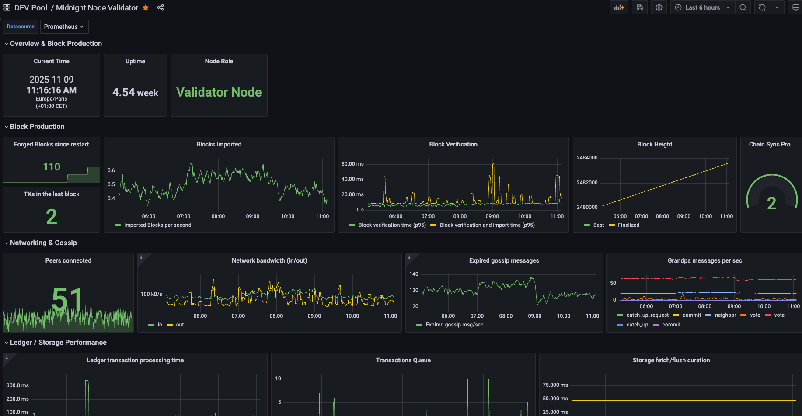

# Midnight Validator

## Monitoring
The Grafana dashboard can be used by anyone who runs a Midnight validator. The grafana dashboard can be imported by using the file [grafana-midnight-validator.json](grafana-midnight-validator.json).

The dashboard is already configured to use a selectable Prometheus datasource in the top panel.



### Prometheus configuration
Simply add the node configuration in your `prometheus.yml` file (usually under `/etc/prometheus/`)

```yml
global:
  scrape_interval: 15s # By default, scrape targets every 15 seconds.

scrape_configs:
   - job_name: 'midnight-pool-preview'
     scrape_interval: 10s
     metrics_path: /metrics
     static_configs:
       - targets: ['<YOUR_NODE_IP_ADDR>:9615']
         labels:
           alias: 'midnight-validator-preview'
```

Just replace the `<YOUR_NODE_IP_ADDR>` with the node IP and evertually change the `job_name` and `alias` if needed.
