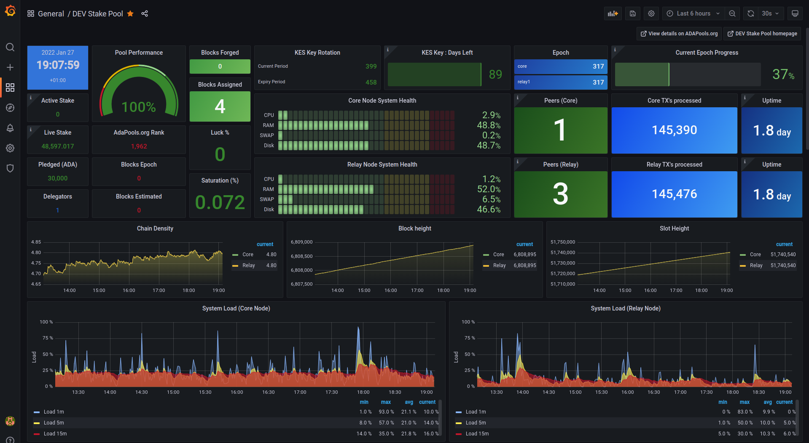

# DEV Pool monitoring
### This folder contains the monitoring of the DEV stake pool metrics

The file [prometheus.yml](prometheus.yml) contains the necessary scrapers for Prometheus.

There are two Grafana dashboards. The [grafana_pool.json](grafana_pool.json) represents the main overview of the 
pool whereas the [grafana_node_exporter_full.json](grafana_node_exporter_full.json) contains a detailed view of the
node exporter of all the nodes of the network.

See https://developers.cardano.org/docs/stake-pool-course/handbook/grafana-dashboard-tutorial/
